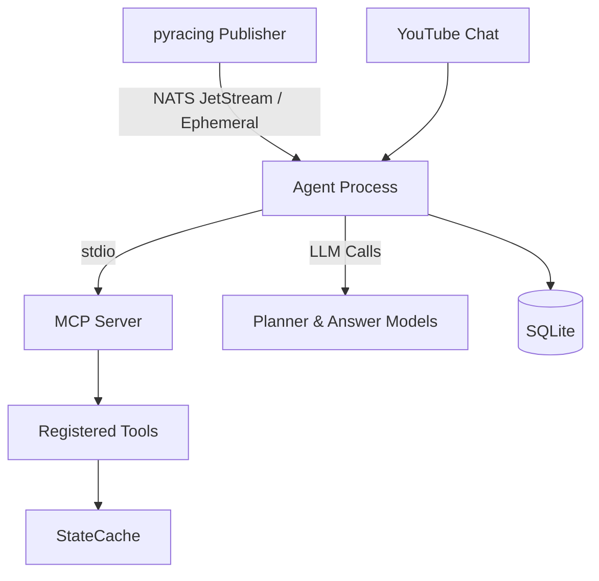

# Sim RaceCenter Director AI Agent Specification

Version: 0.1 (restructured)  
Status: Active – incremental evolution (see Release Increments appendix). For consolidated MVP scope & test matrix see `mvp_v1_definition.md`.

## 1. Project Overview
### 1.1 Purpose
Enhance a live Sim Racing YouTube channel with an AI Director that can (a) understand viewer chat questions in real time, (b) retrieve authoritative race context via tools, and (c) produce concise, accurate answers while suppressing noise.

### 1.2 Key Value Propositions
- Accurate, context‑aware chat responses (not generic hallucinations).
- Tool‑driven answers: data provenance & consistency across sessions.
- Low‑ops single process: NATS ingestion + MCP server + Director agent.
- Extensible tool catalog (add new race analytics without re‑wiring intents).
- Foundation for future operator UI, moderation, highlights, strategy analytics.

### 1.3 Out of Scope (v0.1 / 0.1a / 0.1b)
- Full incident / pit / flag strategy modeling.
- Production RBAC & auth.
- Advanced embeddings infra (pgvector, FAISS) – future flag.

## 2. Functional Requirements
### 2.1 Core Features (Current + Planned)
- Director Chat Answering
   - Input: YouTube chat message (text, author, timestamp).
   - Processing: Planner LLM -> tool plan -> execute tools -> answer LLM.
   - Output: <=200 char answer or silence.
   - Success: Accurate answers; no reply for low‑signal; tools executed only if planned.
- MCP Tool Execution
   - Input: Validated plan with allowed tool names/arguments.
   - Processing: Call registered async functions reading `StateCache`.
   - Output: JSON objects all embedding `schema_version` and `generated_at`.
   - Success: Deterministic schema, graceful error JSON on failure.
- State Cache Maintenance
   - Input: NATS subjects (telemetry, session, future incidents/events).
   - Processing: Normalize & upsert; keep bounded history windows.
   - Output: In‑memory structures for tools; ephemeral.
   - Success: O(1) access; no crashes on malformed frames.
- Battle Detection (`get_current_battle`)
   - Input: Optional top_n_pairs, max_distance_m.
   - Processing: Build normalized proximity pairs; sort by distance.
   - Output: Ordered list of closest car pairs.
   - Success: Stable ordering, empty list when no qualifying pairs.
- Live Snapshot (`get_live_snapshot` – stub level now)
   - Input: None.
   - Processing: Assemble partial roster + placeholder telemetry summary.
   - Output: Minimal snapshot JSON (non-authoritative ordering until 0.1b/c).
   - Success: Returns quickly; safe under empty cache.
- Search Corpus (`search_corpus`, `search_chat`)
   - Input: Query + optional filters.
   - Processing: Lexical / FTS over SQLite.
   - Output: Hit sets; scope counts.
   - Success: No result => empty arrays, not errors.
- Embedding Worker (placeholder)
   - Input: Documents / FAQ updates.
   - Processing: (Deferred) – currently stub.
   - Output: N/A initial.
   - Success: Non-blocking to core runtime.

### 2.2 User Stories
```
As a viewer
I want to ask “Who is in a close battle?”
So that I immediately learn about on‑track action.

As a streamer
I want automated authoritative answers
So that chat is engaged without extra staffing.

As a developer
I want a single registry of tools
So that adding analytics avoids intent rewiring.
```

Extended, structured end‑to‑end scenarios are documented in `use_cases.md` (IDs UC-001 .. UC-012) covering battle awareness, session context, fastest lap, roster, rules lookup, chat history reference, noise suppression, extensibility, and planned penalty / summarization features.

### 2.3 Acceptance (High Level) – See detailed incremental tables in Appendix.
- Silent on unrecognized / low‑value messages.
- Every tool result tagged with metadata.
- Answers capped at 200 chars.
- Resilient to malformed NATS frames.

## 3. System Architecture
### 3.1 High-Level Components


### 3.2 Runtime Subcomponents
- `adapters.nats_listener` – subscribes telemetry/session subjects.
- `core.state_cache` – in‑memory domain projections.
- `mcp.sdk_server` – FastMCP instance + tool decorators.
- `director.agent` – plan/execute/synthesize orchestration.
- `director.chat_responder` – consumes chat messages & triggers agent.
- `embeddings.worker` – placeholder for async embedding updates.

### 3.3 Data Flow
Chat -> Planner -> Tool Plan -> Execute (StateCache / DB) -> Tool JSON -> Answer Prompt -> Short Answer -> Publish to chat.

### 3.4 External Integrations
- NATS JetStream: race telemetry & session snapshots (current), future incidents/events.
- YouTube Chat: inbound user messages (via ingestion scripts / future API wrapper).
- LLM Provider (Gemini flash series): planning + answer generation.
- SQLite: persistence (chat FTS, FAQ pairs, embeddings, summaries, driver stats).

### 3.5 Deployment / Process Model
Single container / process (dev) with optional future split (operator UI, embeddings worker) – tracked under Future Extensions.

## 4. Data Models
See `data_models.md` (placeholder includes TelemetryFrame, RosterDriver, BattlePair, ChatMessage, EmbeddingRecord).  
Implementation Status: PARTIAL (some Pydantic / dataclasses present; full doc pending).

## 5. API Specifications
No public HTTP API in v0.1; interaction is via MCP stdio and internal scripts.  
See `api_mcp_tools.md` for tool contracts.  
Implementation Status: PARTIAL (tool schemas stable; formal OpenAPI-style doc TBD if HTTP added).

## 6. Business Logic Rules
High‑level director & content rules captured in `business_logic_rules.md`.  
Key Live Rules:
- Ignore chat when planner returns empty/invalid JSON.
- Answer length hard cap (200 chars) – truncate gracefully.
- Only execute tools in allowlisted registry; unknown names dropped.
- Battle tool distances filtered by configurable `max_distance_m` (default 50m).
Implementation Status: PARTIAL (rules enforced in code; consolidated spec doc pending).

## 7. Non-Functional Requirements
### 7.1 Performance
- Chat answer latency target: < 2.5s p95 (LLM dependent) – TODO instrument.
- Tool execution target: < 150ms for cache reads at current scale.
### 7.2 Reliability
- Tolerate NATS disconnect (reconnect with backoff, serve stale cache).
- Fail-safe planner errors -> silence (no degraded guess).
### 7.3 Security
- No external writes beyond SQLite; sanitize tool outputs before LLM.
- API keys through env vars only.
### 7.4 Scalability
- In-memory caches sized for single active session (configurable ring sizes). Future sharding not required until >100 cars / multi-session concurrency.
### 7.5 Observability (Planned)
- Structured log envelope: {message_id, plan_tools, timings_ms} – TODO.
### 7.6 Maintainability
- Single tool registry file to minimize sprawl; Pydantic validation for arguments.

## 8. Configuration
### 8.1 Environment Variables
| Name | Description | Default | Required |
|------|-------------|---------|----------|
| NATS_URL | NATS server URL | nats://nats:4222 | Yes (runtime) |
| SQLITE_PATH | SQLite DB path | /workspace/data/agent.db | Yes |
| OPENAI_API_KEY | Embedding API key (if OpenAI path) | (unset) | No (stub ok) |
| EMBEDDING_MODEL | Embedding model name | text-embedding-3-small | No |
| LOG_LEVEL | Logging level | INFO | No |
| MCP_SERVER_CMD | Override spawn command | (internal) | No |
| SNAPSHOT_POS_HISTORY | Frames to keep (positions) | 900 | No |
| INCIDENT_RING_SIZE | Recent incidents retained | 300 | No |
| LLM_PLANNER_MODEL | Planner model id | gemini-2.5-flash | No |
| LLM_ANSWER_MODEL | Answer model id | gemini-2.5-flash | No |

### 8.2 Feature Flags (Future)
| Flag | Description | Status |
|------|-------------|--------|
| ENABLE_INCIDENT_STREAM | Ingest incidents/events | TODO |
| ENABLE_OPERATOR_WS | Launch operator WebSocket server | TODO |
| USE_EXTERNAL_VECTOR_DB | Switch to pgvector / external | TODO |

## 9. Success Metrics
See `success_metrics.md` (placeholder). Initial candidate KPIs:
- Answer Accuracy (manual labeled sample) – Target ≥85% correct.
- Chat Coverage (answered messages / total questions) – Balanced with noise suppression.
- Latency p95 (planner+answer) – Target <2.5s.
- Tool Error Rate (<2% of invoked tool calls).
Implementation Status: TODO (instrumentation not yet implemented).

## 10. Release Increments (Summary)
- 0.1 (MVP): Dev container, settings, stub tools, minimal director.
- 0.1a: Battle tool + telemetry/session roster ingestion; basic intent expansion.
- 0.1b: Live NATS ingestion integration robustness (malformed handling, reconnect).
- 0.1c (Planned): Extended iRacing data contract (standings, gaps, flags, incidents, pits) enabling richer tools & restored GAP/LEADER semantics.

## 11. Tool Catalog (Current)
| Tool | Purpose | Inputs | Status |
|------|---------|--------|--------|
| get_live_snapshot | Composite (stub) snapshot | none | PARTIAL |
| get_current_battle | Closest car proximity pairs | top_n_pairs, max_distance_m | IMPLEMENTED |
| get_fastest_practice | Fastest lap + top N (practice) | n | IMPLEMENTED (requires richer lap data) |
| get_roster | Roster summary | none | IMPLEMENTED |
| get_session_history | Recent session state changes | limit | IMPLEMENTED (data availability limited) |
| search_chat | FTS over chat | query, filters | IMPLEMENTED |
| search_corpus | Multi-scope lexical search | query, scopes | IMPLEMENTED |
| summarize_recent_events | Event summarization | window | DEFERRED |
| propose_penalty | Penalty inference | context | DEFERRED |

## 12. Tool Response Consistency Rules
All tool responses MUST include:
1. schema_version (int)
2. generated_at (ISO8601 UTC) if synthesized
3. Omit large arrays unless explicitly requested (bounded lists)
4. Normalized numeric units (seconds float; distances meters with 1 decimal when user facing)

## 13. Director Planning & Execution Flow
1. Receive chat message.
2. Planner prompt (LLM) -> JSON plan array [{name, arguments}].
3. Empty / invalid plan => ignore message (noise suppression & token cost control).
4. Execute each allowed tool via in‑process stdio MCP client (errors -> {error:"tool_failed"}).
5. Answer LLM gets original message + tool JSON output bundle -> {"answer": str}.
6. Enforce 200 char cap; truncate or drop if empty post-trim.
7. Publish answer.

Safeguards: invalid names dropped; argument validation via Pydantic; missing API key -> silent ignore.

## 14. Embeddings Strategy (Current & Future)
Current: Brute‑force cosine similarity for small corpus; SQLite (doc_id, dim, vector BLOB, norm).  
Future: Optional pgvector / external store via feature flag; incremental rebuild when content hash changes.

## 15. Development Environment
- Python 3.12 dev container; tooling: pytest, black, isort, mypy, ruff, pre-commit.
- Make targets: dev, test, format, run-mcp, init-db.

## 16. Future Extensions (Roadmap Candidates)
- Operator WebSocket server / control panel.
- Penalty precedent mining & classification.
- Strategy modeling (fuel, tires, stint projections).
- External vector DB integration.
- Authorization & RBAC for operator actions.
- Multi-session historical analytics (DuckDB / Postgres).

## 17. Implementation Guidelines
1. Keep tools pure & side-effect free except reading caches.
2. Input validation with Pydantic models.
3. Centralize configuration via `Settings`.
4. Single registration point for tools (avoid fragmentation).
5. Add docstrings & type hints everywhere.
 6. Follow FastMCP patterns (server lifecycle, tool builder structure, error envelopes, schema versioning) documented in `fastmcp_design_patterns.md`.

## 18. Minimal Viable Product Definition (v0.1 Recap)
- Dev container & dependency management.
- Settings loader working.
- NATS listener skeleton (placeholder subjects ok initially).
- State cache with dummy update methods.
- MCP server with `get_live_snapshot` (stub) & `search_corpus` (empty set).
- Director agent stub handling LEADER queries (simplistic heuristic).
- Embedding worker placeholder.
- `init_db` script setting up schema.

## 19. Non-Goals (v0.1)
- Real penalty classification.
- Full pit / stint / fuel strategy modeling.
- Complete transcript ingestion pipeline.
- Production-grade auth & multi-tenant security.

## 20. Initial PR Acceptance Checklist (v0.1)
- `docker compose up --build` success.
- `make init-db` creates all tables.
- `make run-mcp` starts server & logs ready.
- `pytest` green (placeholder tests ok).
- `ruff` / `black` no diffs.
- `mypy` no blocking errors (warn-return-any allowed initially).

## 21. Appendix A – Increment 0.1a Details
(Battle tool introduction, telemetry roster ingestion) – migrated from legacy spec. See earlier description; acceptance criteria retained.

## 22. Appendix B – Increment 0.1b Details
(Live NATS ingestion robustness) – migrated; acceptance criteria retained.

## 23. Appendix C – Planned Increment 0.1c (Extended iRacing Data Contract)
Objective: Formalize versioned subjects for standings, gaps (seconds), incidents, pit events, flags, track conditions, driver status, fuel/tire -> enables restored GAP & true LEADER intents plus narrative tools.  
Artifacts (planned): rules/penalties.md (placeholder), faq/popular.json.

---
End of Restructured Specification
---